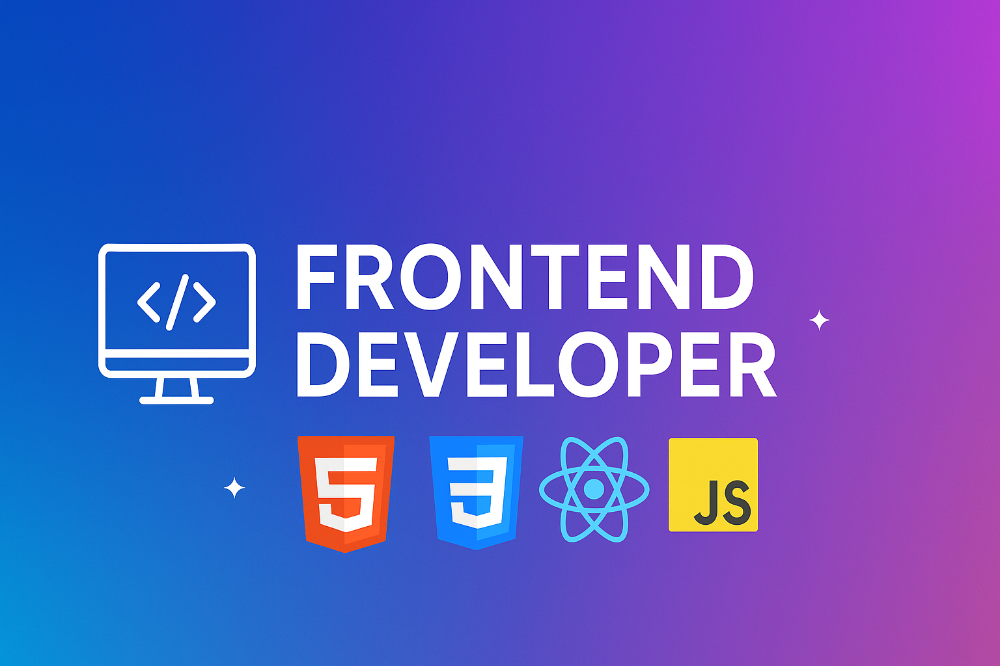

<!-- Banner -->

<!-- Title -->
<h1>I am Mohammad Mahdi Ganji</h1>

<!-- Professional Intro -->

  I'm Mohammad Mahdi Ganji, a 20-year-old software engineering student with a passion for building clean, scalable, and visually impressive web applications. I specialize in React, Framer Motion, and modern UI/UX principles. My goal is to create projects that not only work flawlessly but also leave a lasting impression. I believe that great code is not just functional—it should be elegant, maintainable, and intuitive. I'm currently focused on building resume-worthy projects that showcase advanced animation, clean architecture, and real-world problem solving.

