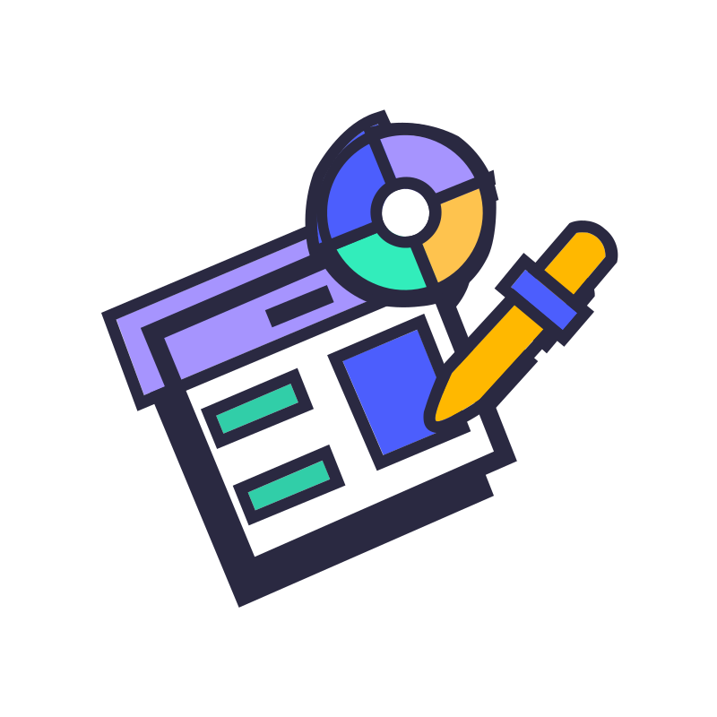
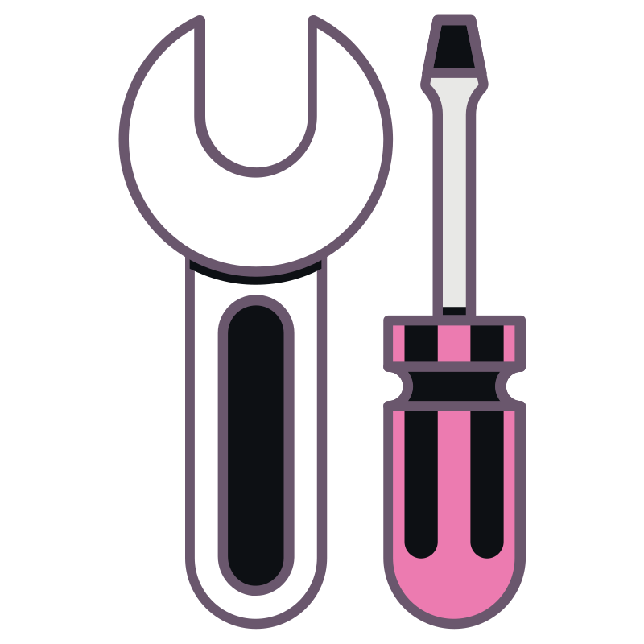
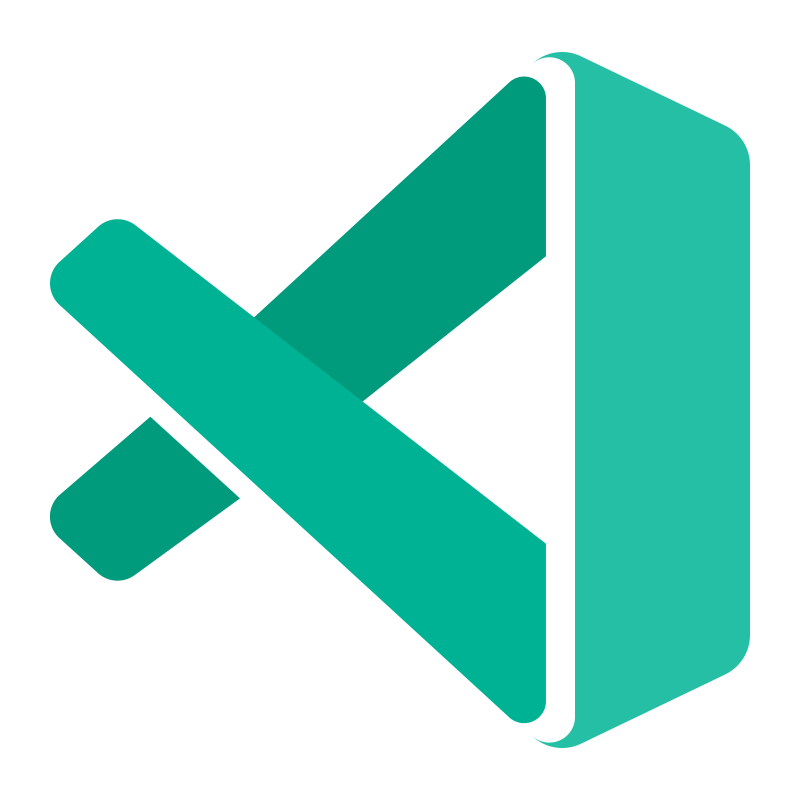

<!-- Banner -->

<!-- Title -->
<h1>I am Mohammad Mahdi Ganji</h1>

<!-- Professional Intro -->

  I'm Mohammad Mahdi Ganji, a 20-year-old software engineering student with a passion for building clean, scalable, and visually impressive web applications. I specialize in React, Framer Motion, and modern UI/UX principles. My goal is to create projects that not only work flawlessly but also leave a lasting impression. I believe that great code is not just functional—it should be elegant, maintainable, and intuitive. I'm currently focused on building resume-worthy projects that showcase advanced animation, clean architecture, and real-world problem solving.

<h2>🛠 Tech Stack</h2>

  I work primarily with modern frontend technologies and tools that help me build responsive, animated, and scalable web applications. Here's a snapshot of my current stack:

 
<h2>My Skills</h2>
 
 
<ul>
  <li><strong> Languages:&nbsp;&nbsp;&nbsp;&nbsp;&nbsp;&nbsp;&nbsp;&nbsp;&nbsp;&nbsp;&nbsp;&nbsp;&nbsp;&nbsp;</strong>  HTML5, &nbsp;&nbsp;&nbsp;&nbsp;&nbsp;&nbsp;&nbsp;&nbsp;&nbsp;&nbsp;&nbsp;&nbsp;&nbsp; CSS3, &nbsp;&nbsp;&nbsp;&nbsp;&nbsp;&nbsp;&nbsp;&nbsp;&nbsp;&nbsp;&nbsp;&nbsp;&nbsp; JavaScript (ES6+)</li>
 
 
  <li><strong> Frameworks & Libraries:  &nbsp;&nbsp;&nbsp;&nbsp;&nbsp;&nbsp;&nbsp;&nbsp;&nbsp;&nbsp;&nbsp;&nbsp;&nbsp;</strong>  React,  &nbsp;&nbsp;&nbsp;&nbsp;&nbsp;&nbsp;&nbsp;&nbsp;&nbsp;&nbsp;&nbsp;&nbsp;&nbsp; Styled Components &nbsp;&nbsp;&nbsp;&nbsp;&nbsp;&nbsp;&nbsp;&nbsp;&nbsp;&nbsp;&nbsp;&nbsp;&nbsp;&nbsp;  Tailwind css</li>
    
   
  <li><strong> Tools:  &nbsp;&nbsp;&nbsp;&nbsp;&nbsp;&nbsp;&nbsp;&nbsp;&nbsp;&nbsp;&nbsp;&nbsp;&nbsp;</strong>  Git,  &nbsp;&nbsp;&nbsp;&nbsp;&nbsp;&nbsp;&nbsp;&nbsp;&nbsp;&nbsp;&nbsp;&nbsp;&nbsp; VSCode</li>
   
   
  <li><strong> Design:  &nbsp;&nbsp;&nbsp;&nbsp;&nbsp;&nbsp;&nbsp;&nbsp;&nbsp;&nbsp;&nbsp;&nbsp;&nbsp;</strong>  Figma,  &nbsp;&nbsp;&nbsp;&nbsp;&nbsp;&nbsp;&nbsp;&nbsp;&nbsp;&nbsp;&nbsp;&nbsp;&nbsp; Responsive Design</li>
</ul>
